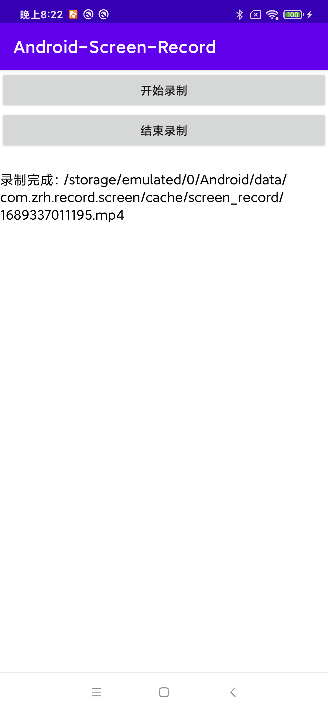

# Android-Screen-Recorder

一个简单的Android屏幕录制框架，功能完善使用简单。



### 使用步骤。

#### 1.初始化ScreenRecordManager。

```kotlin
ScreenRecordManager.init(this, RecordConfig().apply {
    // 设置通知图标
    notificationIcon = R.mipmap.ic_launcher_round
    // 设置通知展示的内容
    notificationContent = "Recording..."

    // 设置录屏的最大宽高
    maxWidth = 1080
    maxHeight = 1920
    // 设置录屏的最大时间，单位秒
    maxDurationSec = 60
    // 设置比特率
    bitrate = maxWidth * maxHeight * 2
    // 设置帧率
    fps = 24

    // 设置录屏输出的目录
    val cache = if (externalCacheDir != null) externalCacheDir else cacheDir
    outputDir = File(cache, "screen_record")
})
```

#### 2.开始录屏。

```kotlin
ScreenRecordManager.start(this)

// 可以添加录屏监听
val callback = object : ScreenRecordCallback {
    override fun onCompleted(file: File) {
    }

    override fun onError(code: Int, msg: String) {
    }

    override fun onDurationChanged(duration: Long) {
    }
}
ScreenRecordManager.addCallback(callback)
// 移除监听
ScreenRecordManager.removeCallback(callback)
```